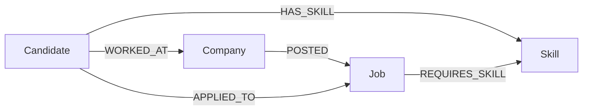

# Skillgraph — skill-based job/candidate matching

A small full-stack app backed by [CognoDB](https://console.cognodb.com), built for the
Wexa AI take-home assignment. It models candidates, jobs, companies and skills as a
graph and uses graph traversals to power job recommendations, candidate matching,
and a referral network lookup.

## Why a graph database?

Job matching is a relationships problem, not a rows-in-a-table problem. The two
questions this app answers most — "which jobs fit this candidate's skills?" and
"who else could do this job?" — both require walking from one entity, through a
shared set of skills, to a different entity of the same or another type, and
scoring by how much overlap exists along the way.

In a relational schema this means a `candidate_skills` junction table joined to a
`job_skills` junction table, grouped and counted, for every single match query. It
works, but it gets worse fast: the referral network feature in this app ("people
who worked alongside people I worked with") needs a variable number of hops
through a self-referencing company/employment relationship. In SQL that's a
recursive CTE, rewritten by depth, and it does not compose well with the skill-match
queries above it. In Cypher, both are one `MATCH` pattern:

```cypher
MATCH (c:Candidate {id: $id})-[:HAS_SKILL]->(s:Skill)<-[:REQUIRES_SKILL]-(j:Job)
```

```cypher
MATCH (c:Candidate {id: $id})-[:WORKED_AT]->(:Company)<-[:WORKED_AT*1..2]-(colleague)
```

The graph model also makes the schema honest about what the domain actually looks
like: skills are shared across many candidates and many jobs, companies post many
jobs, and candidates move between companies. None of that is a hierarchy — it's a
network, and CognoDB lets the queries read the same way the domain does.

## Data model



**Nodes**
| Label | Key properties |
|---|---|
| `Candidate` | id, name, location, experienceYears, bio |
| `Job` | id, title, location, seniority, description |
| `Company` | id, name, industry |
| `Skill` | name (unique) |

**Relationships**
| Type | Direction | Properties |
|---|---|---|
| `HAS_SKILL` | Candidate → Skill | proficiency |
| `REQUIRES_SKILL` | Job → Skill | weight |
| `POSTED` | Company → Job | — |
| `WORKED_AT` | Candidate → Company | role, years |
| `APPLIED_TO` | Candidate → Job | status, appliedAt |

## Project structure

```
backend/
  src/
    config/db.js        # driver singleton, connection check, query runner
    queries/cypher.js    # every Cypher query, all parameterised
    routes/               # candidates, jobs, skills endpoints
    server.js             # Express app, startup check, error handler
  seed/
    data.js               # sample candidates, jobs, companies, skills
    seed.js                # loads seed data via parameterised Cypher
frontend/
  src/
    api/client.js          # fetch wrapper for the backend
    pages/                  # Home, CandidateDetail, JobDetail, AddCandidate, AddJob
    components/             # shared UI (loading/error/empty states, brand mark)
```

## Setup

### 1. Create a CognoDB instance

1. Sign up at [console.cognodb.com/signup](https://console.cognodb.com/signup) (no
   card needed for the free tier).
2. Create a free `c0` instance and pick a region.
3. Copy the connection URI (`bolt+s://<instance-id>.databases.cognodb.cloud`) and
   the generated password for the `cognodb` user — the password is shown once.

### 2. Backend

```bash
cd backend
npm install
cp .env.example .env
# edit .env with your COGNODB_URI and COGNODB_PASSWORD
npm run seed     # loads sample candidates, jobs, companies and skills
npm start        # API on http://localhost:4000
```

`GET /api/health` reports whether the API can currently reach CognoDB.

### 3. Frontend

```bash
cd frontend
npm install
npm run dev       # http://localhost:5173, proxies /api to the backend
```

For a production build talking to a separately hosted backend, copy
`frontend/.env.example` to `.env` and set `VITE_API_BASE_URL`.

## Main queries, explained

All queries live in `backend/src/queries/cypher.js` and run through parameterised
Cypher via the official `neo4j-driver` package — no string concatenation.

- **`recommendJobsForCandidate`** — 2-hop: Candidate → Skill ← Job. Counts shared
  skills per job and ranks by overlap. Backs the "Recommended jobs" section on a
  candidate's page.
- **`matchCandidatesForJob`** — the same shape, mirrored: Job → Skill ← Candidate.
  Backs "Matched candidates" on a job's page.
- **`findSimilarCandidates`** — 2-hop: Candidate → Skill ← other Candidate. Finds
  people with overlapping skill sets.
- **`getReferralNetwork`** — variable-length (1–3 hop) walk through
  `WORKED_AT → Company ← WORKED_AT`. This is the query a relational schema
  struggles with: it needs a different join for every hop depth, or a recursive
  CTE. Here it's one pattern with a hop bound.
- **`getSkillGap`** — required skills on a job that a given candidate doesn't have,
  using `OPTIONAL MATCH` + a null check instead of a `NOT IN` subquery.
- **`getRelatedSkills`** — 2-hop skill co-occurrence: which skills tend to appear
  on the same job postings.

## Engineering notes

- Connection details are read from environment variables (`backend/.env`, never
  committed — see `.gitignore`).
- `src/config/db.js` centralises session handling: every query opens and closes
  its own session, and `verifyConnectivity()` runs at startup so the server logs a
  clear warning instead of failing silently.
- The Express error handler in `server.js` distinguishes a database-connectivity
  error from any other failure and returns a clean JSON message either way,
  instead of leaking a stack trace or crashing the process. The frontend shows
  this as a banner rather than a blank screen.
- The one place Cypher can't take a parameter is the hop-count bound in a
  variable-length pattern (`*1..N`). `getReferralNetwork` handles this as a
  function that clamps the hop count to a safe integer range server-side before
  interpolating it — every actual value (IDs, limits) still goes through `$params`.

## Demo

- Hosted app: _add your deployed URL here_
- Screen recording: _add your recording link here_
- Screenshots: _add screenshots of the UI here_
